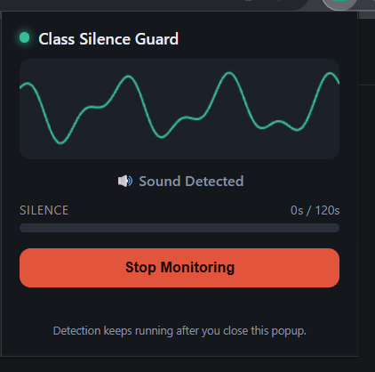
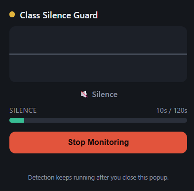
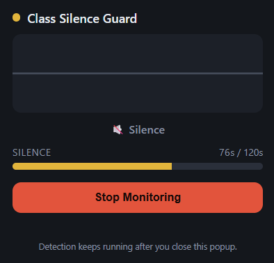
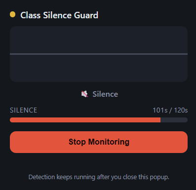

# 🔇 Class Silence Guard

**Class Silence Guard** is a Chrome extension that monitors audio in your class tab and automatically closes Chrome after 2 minutes of continuous silence — useful for online lectures that end abruptly or run long after the professor has stopped speaking.

---

## ✨ Features

- 🎙️ Real-time tab audio monitoring via amplitude-based silence detection
- 📊 Live waveform visualization — dynamic when sound is detected, flat during silence
- ⏱️ Color-coded silence timer with a 120-second countdown
- 🔒 No recording or storage — audio is analyzed in real time only, never saved

---

## 🎨 Timer Color Logic (Percentage-Based)

The progress bar changes color based on the **percentage of silence elapsed**, not fixed time values. The default silence limit is **120 seconds** (2 minutes). The color ranges are calculated automatically as a percentage of `SILENCE_LIMIT_MS`.

| Color | Percentage Range | Exact Time Range (Default 120s) |
|-------|------------------|---------------------------------|
| 🟢 **Green** | 0% – 39% | 0s – 47s |
| 🟡 **Yellow** | 40% – 79% | 48s – 95s |
| 🔴 **Red** | 80% – 100% | 96s – 120s |

> **Note:** These times are based on the default `SILENCE_LIMIT_MS = 120000`. If you change the limit (e.g., to 60s), the colors automatically adjust proportionally.

---

## 📸 Screenshots

### 🔊 Sound Detected (Active)



*The waveform is active and the timer is reset.*

---

### 🟢 Silence Just Started (Green Timer)



*The waveform is flat, and the timer has just started counting.*

---

### 🟡 Silence Warning (Yellow Timer)



*The timer has reached 40% of the limit — silence is ongoing.*

---

### 🔴 Silence Critical (Red Timer)



*The timer has reached 80% of the limit — Chrome will close soon.*

---

## 📦 Download the Extension

First, download the latest version of the extension as a ZIP file:

[⬇️**Download the latest version (ZIP)**](https://github.com/pouya-abdoli/class-silence-guard/releases/latest/download/class-silence-guard.zip)
> Once downloaded, extract the ZIP folder and follow the installation steps below.

---

## 📦 Installation (Unpacked / Developer Mode)
1. Open `chrome://extensions`
2. Enable **Developer mode** (top-right toggle)
3. Click **Load unpacked**
4. Select this folder (`class-silence-guard/`)
5. 📌 Pin the extension to your toolbar for quick access

---

## 🚀 Usage

1. Open your class tab (Zoom, Google Meet, Teams, YouTube, etc.)
2. Make sure it's the **active tab** in the active window
3. Click the extension icon, then select **Start Monitoring**
4. Grant the tab-capture permission when prompted (first run only)
5. Monitoring continues in the background — reopen the popup anytime to check status

---

## 🧪 Testing

To test without waiting the full 2 minutes, temporarily lower these values in `offscreen.js`:

```js
SILENCE_LIMIT_MS = 10000  // 10 seconds
WARNING_MS = 5000         // 5 seconds
```

Restore them to `120000` / `110000` before real use.

### 🎵 Simulating Audio States

| Action                            | Result                                        |
|------------------------------------|------------------------------------------------|
| Pause a video / mute the tab       | ✅ Silence detected                             |
| Play music or video                | 🔄 Timer resets                                 |
| Quiet lecturer / background noise  | ⚙️ Adjust `SILENCE_THRESHOLD` (default `0.02`)  |

---

## 🔒 Privacy

Class Silence Guard performs all audio analysis **locally and in real time**. No audio is recorded, saved, or transmitted anywhere — the extension only measures amplitude to determine sound vs. silence, then discards each sample immediately.

---

## 🛠️ Customization

| Setting             | Location       | Purpose                                         |
|-----------------------|----------------|--------------------------------------------------|
| `SILENCE_THRESHOLD`   | `offscreen.js` | Amplitude cutoff for silence detection            |
| `SILENCE_LIMIT_MS`    | `offscreen.js` | Total silence duration before Chrome closes       |
| `WARNING_MS`          | `offscreen.js` | When the cancellable warning notification fires   |

For debugging, inspect the service worker console via `chrome://extensions` → **service worker** link under the extension.

---

## 📁 File Structure

| File                                   | Role                                                            |
|------------------------------------------|---------------------------------------------------------------------|
| `manifest.json`                        | MV3 manifest and permissions                                     |
| `background.js`                        | Service worker — orchestration, notifications, window closing    |
| `offscreen.html` / `offscreen.js`      | Hidden document running the AudioContext/AnalyserNode analysis   |
| `popup.html` / `popup.css` / `popup.js`| Visible UI — waveform, timer, start/stop control                  |

---

## 📄 License

MIT — feel free to fork, modify, and use for your own classes. 

**Made with ❤️ for sleepy students everywhere**